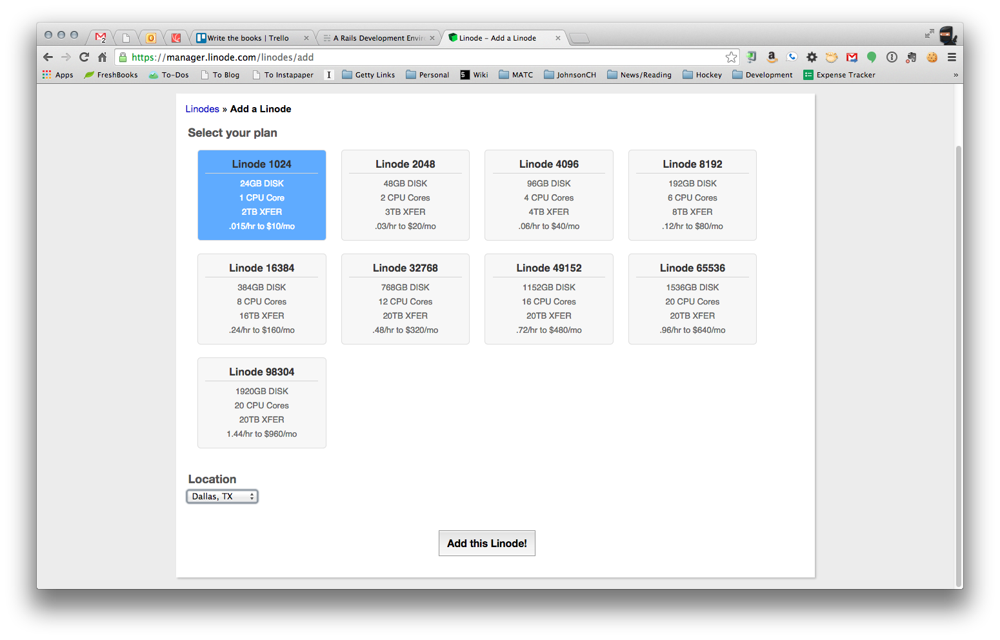
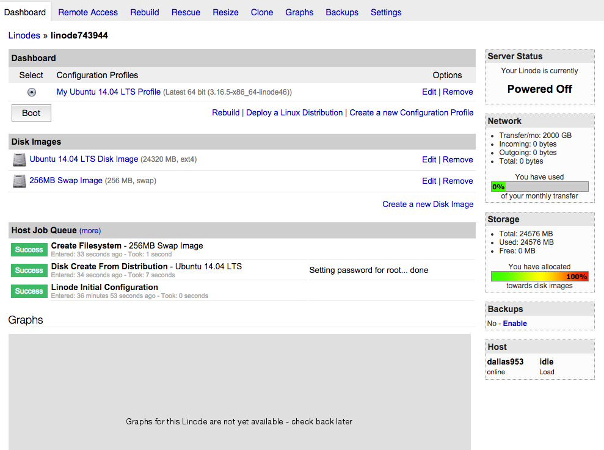

#Lab 10 
* Points 10
* Date due: 12/18/2014 at 5:00pm CST

##Assignment

###Getting setup
* Go to www.linode.com/trial
* Use promotion code given in class (or email instructor for it)

Once your account is activated you'll need to choose a virtual machine (VM) size and location.  My suggestion for a location is Dallas and the 1024 size, we should see something similar to the following figure:



Once we have a location chose we'll be directed over to a screen which lists all our VMs like the following figure:


Once our VM has finished being created we can click on it and get it setup! Inside of the VM configuration we can choose to 'Deploy a Linux Distribution'. For class we'll choose Ubuntu 14.04 LTS, this is the newest long term supported distribution.  Ubuntu is a common linux distribution for Rails applications. We'll also need to enter a password for the root user, choose something fairly complex but easy enough to remember.

After configuring the VM it's dashboard screen shows us a lot of information, let's explore the following figure:



On the right side of the screen we see the current status of our VM and it's usage stats. On the left top we find the control button for the VM. Let's click on 'Boot' and start the VM up.

While that is booting up, let's hop over to our Nitrous.io box and get ready to connect to our Linode VM. Rather than launching the IDE we'll just use the console.  Back in the Linode VM configuration dashbord we can go on the 'Remote Access' tab and get the information to SSH to our Linode VM.  We'll copy the SSH comand and paste it into the Nitrous.io terminal as seen in the following figure:


Now that we are SSHed into our VM let's make sure all the base packages are up to date.

```
$ apt-get update
$ apt-get upgrade
```

###Creating a deploy user
To make managing administrative access our VM let's create a group, 'wheel', that will contain users with sudo privileges.

```
/usr/sbin/groupadd wheel
```

Next we'll use the ```visudo``` command to add the wheel group to the sudoers list.

```
/usr/sbin/visudo
```

With the sudoers file open we'll add the following lines to it:

```
## Allows people in group wheel to run all commands
%wheel  ALL=(ALL)       ALL
```

Then use ctrl-o to save the file followed by ctrl-x to exit the editor. With that file saved we can add our deploy user with the following command, and answer all the questions it prompts us for.

```
/usr/sbin/adduser deploy 
```

Next we'll add our deploy user to the wheel group.
```
/usr/sbin/usermod -a -G wheel deploy
```
Once we have the deploy user added to the group, we can logout and login as the deploy user.

###SSH Keys
```
$ ssh-keygen -t rsa -C "admin@myserver.com"
$ cat .ssh/id_rsa.pub
```

With our SSH key created we need to add it to our GitHub account so the server can clone our repository.

Next we'll want to upload our development machine (nitrous.io) ssh key so we don't need to keep typing the following command:
```
$ ssh-copy-id -i ~/.ssh/id_rsa.pub deploy@<your servers ip>
```

###Installing software
```
$ sudo apt-get -y install curl git-core build-essential zlib1g-dev libssl-dev libreadline-gplv2-dev libcurl4-openssl-dev node sqlite3 nodejs npm
```

####Rbenv

Let's install Rbenv to manage our Rubies.

```
$ curl https://raw.githubusercontent.com/fesplugas/rbenv-installer/master/bin/rbenv-installer | bash
```

```
$ vim ~/.bashrc
```

```
export RBENV_ROOT="${HOME}/.rbenv"

if [ -d "${RBENV_ROOT}" ]; then
  export PATH="${RBENV_ROOT}/bin:${PATH}"
  eval "$(rbenv init -)"
fi
```

```
$ source ~/.bashrc
```

```
$ rbenv install 2.2.2
$ rbenv global 2.2.2
```
####MySQL
Installing mysql:

```
$ sudo apt-get install mysql-server mysql-client libmysqlclient-dev
```
I chose for this demo a username: root and password: root.  After your server is setup, create a database for your applicaiton.

```
$ mysql -u root -proot
mysql > create database <application>_production
```


####Passenger and Nginx
```
$ gem install passenger bundler
$ rbenv rehash
```

```
$ sudo /home/deploy/.rbenv/shims/passenger-install-nginx-module
```

```
$ wget https://raw.githubusercontent.com/johnsonch/nginx-init-ubuntu/master/nginx -O nginx
$ sudo mv nginx /etc/init.d/nginx
$ sudo chmod a+x /etc/init.d/nginx
$ sudo chown root /etc/init.d/nginx
```

```
$ sudo vim /opt/nginx/conf/nginx.conf
```

```
server {                                                                                          
    listen       80;                                                                              
                                                                                                  
    root /var/www/current/public;                                                                 
    passenger_enabled on;                                                                         
                                                                                           
    error_page   500 502 503 504  /50x.html;                                                      
    location = /50x.html {                                                                        
        root   html;                                                                              
    }                                                                                             
                                                                                                  
}
```

```
$ sudo mkdir -p /var/www
$ sudo chown deploy /var/www/
```

###Setting up our app

```
gem 'capistrano-rails'
gem 'capistrano-bundler'
gem 'capistrano-rbenv', '~> 2.0', require: false
gem 'mysql2'
```

And remove the Postgres gem if you are following along with this tutorial

```
$ bundle install --without production
```

```
$ bundle exec cap install
```
Add the following to your config/deploy/production.rb
```
role :app, %w{deploy@<your server ip>}
role :web, %w{deploy@<your server ip>}
role :db,  %w{deploy@<your server ip>}

server '<your server ip>', user: 'deploy', roles: %w{web app}

set :ssh_options, {
    keys: %w(/home/action/.ssh/id_rsa),
    forward_agent: true,
    user: 'deploy'
  }
```
Then change your config/deploy.rb to the following:
```
# config valid only for Capistrano 3.1
lock '3.2.1'

set :application, 'your_application_name'
set :repo_url, 'git@github.com:your_git_url'
set :rbenv_ruby, '2.2.2'

# Default branch is :master
ask :branch, proc { `git rev-parse --abbrev-ref HEAD`.chomp }.call

# Default deploy_to directory is /var/www/my_app
set :deploy_to, '/var/www'

# Default value for :pty is false
set :pty, true

# Default value for :linked_files is []
set :linked_files, %w{config/database.yml}

namespace :deploy do

  desc 'Restart application'
  task :restart do
    on roles(:app), in: :sequence, wait: 5 do
       execute :touch, release_path.join('tmp/restart.txt')
    end
  end

  after :publishing, :restart

end
```
Then modify the capfile in the root of your application to look like the following:
```
# Load DSL and Setup Up Stages
require 'capistrano/setup'

require 'capistrano/deploy'
require 'capistrano/rbenv'
require 'capistrano/bundler'
require 'capistrano/rails/assets'
require 'capistrano/rails/migrations'

# Loads custom tasks from `lib/capistrano/tasks' if you have any defined.
Dir.glob('lib/capistrano/tasks/*.rake').each { |r| import r }
```

```
$ bundle exec cap production deploy:check 
```

We'll need to create a database.yml file in var/www/shared/config with the correct values for your application.

```
production:
  adapter: mysql2
  database: <application>_production  
  host: localhost
  username: root
  password: root
```

We'll also need to add secret to our config/secrets.yml, you can do the not best practice and use the develop one.

Now we should be able to deploy our site.
```
$ bundle exec cap production deploy deploy:migration
```

##Turn in instructions
* on Blackboard under Labs find Lab 8 submit a word/text document with the following information:
  * Name
  * Date
  * Linode IP
  * Region of Linode

###Notes:
* If you make your github repository for labs private, you'll need to add "johnsonch" as a contributor to the repository so I can access it.
